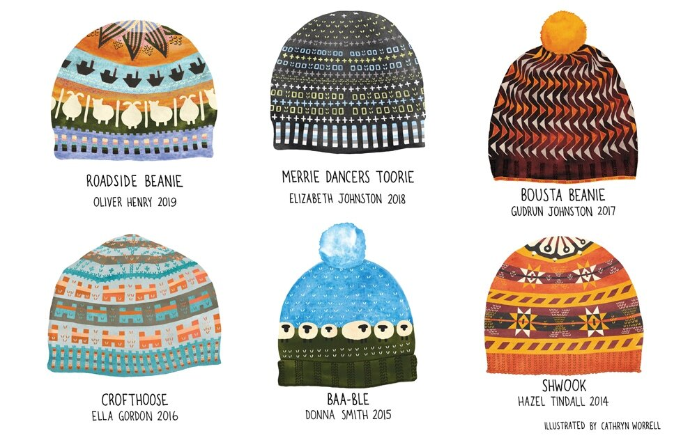

```{r setup, include=FALSE}
knitr::opts_chunk$set(echo = FALSE, warning = FALSE, message = FALSE)
```


```{r Libraries}
library(tidyverse)
library(raster)
library(kableExtra)
library(DT)
library(magick)
library(leaflet)

```


## A Homage to Shetland Wool Week {.tabset}

My first foray into colour-work knitting was through [Shetland Wool Week](https://www.shetlandwoolweek.com/). Shetland Wool Week is a week long event celebrating Britain's most northerly native sheep, the Shetland textile industry and the rural farming community. 

```{r}

leaflet() %>%
  addProviderTiles(providers$Esri.OceanBasemap) %>%
  setView(lng = -1.2,
          lat = 60,
          zoom = 7) %>%
  addMarkers(lng = -1.14199,
                   lat = 60.15309,
                   label = "My favourite yarn shop: [Jamieson's of Shetland](https://www.jamiesonsofshetland.co.uk/jamiesons-of-shetland--cobweb-ultra-25-c.asp)")

```


Each year a designer creates a knitting pattern for a hat for the week. They are wonderful designs and a great way of connecting knitters around the world. You never know where you'll meet a Shetland Wool Weeker!


```{r, fig.cap = "**Shetland Wool Week Hats.** Illustration by [Cathryn Worrell](https://cathrynworrell.com/blog/2019/09/06/shetland-wool-week-hats). Patterns by designers, [Olive Henry](https://olivershetlandwoolblog.home.blog/), [Elizabeth Johnston](http://www.shetlandhandspun.com/), [Gudrun Johnston](https://www.instagram.com/gudrunjohnston/), [Ella Gordon](https://ellagordondesigns.co.uk/), [Donna Smith](https://www.donnasmithdesigns.co.uk/), and [Hazel Tindall](https://www.hazeltindall.com/)", out.width = "120%"}
  
```

## The Bousta Beanie

My first ever colour-work project was knitting [Gudrun Johnston's](https://www.instagram.com/gudrunjohnston/) [Bousta Beanie](https://www.ravelry.com/patterns/library/bousta-beanie) hat. It's been a real delight this year to revisit the pattern as my wedding present to two friends, Julianna and Tom, who were married this Spring. 


```{r, fig.cap = "My trusty Bousta Beanie. Pattern by Gudrun Johnston", out.width = "80%"}
  knitr::include_graphics("images/bousta_beanie.jpg")
```


I knit the pattern using [Jamieson's of Shetland](https://www.jamiesonsofshetland.co.uk/jamiesons-of-shetland--cobweb-ultra-25-c.asp) 2-ply yarn. My friends were excited and a little overwhelmend by all the possible color combinations they could choose! 

## Introducing Swatch-Creator

As a Professor of Computer Science at College of the Atlantic in Bar Harbor, Maine. I knew there was a way that I could help them choose the colours for their hat using coding and a bit of webscraping! And thus, swatch-creator was born as a way to choose and try out different colors for patterns. 


To do this I scraped the photos of the yarns from the Jamieson's website. I then set about extracting the colors. 

```{r, echo = TRUE, eval = FALSE}

# Function to count the colours (adapted from Jeroen Ooms and Matt Dray: https://www.rostrum.blog/2018/11/25/art-of-the-possible/)


get_top_color_blend <- function(image_path) {
  image_i <- image_read(image_path)
  img <- image_convolve(image_i, 'Gaussian:0x5', scaling = '60,20%')
  top_hex <- image_data(img) %>%
    apply(2:3, paste, collapse = "") %>% 
    as.vector %>% table() %>%  as.data.frame() %>% 
    setNames(c("hex", "freq")) %>%
    mutate(hex = paste("#", hex, sep="")) %>%
    slice_max(order_by = freq, n = 1) %>%
    pull(hex)
  
  return(top_hex) # Keep researching to eplace with average
}

get_top_color <- function(image_path) {
  img <- image_read(image_path)
  top_hex <- image_data(img) %>%
    apply(2:3, paste, collapse = "") %>% 
    as.vector %>% table() %>%  as.data.frame() %>% 
    setNames(c("hex", "freq")) %>%
    mutate(hex = paste("#", hex, sep="")) %>%
    slice_max(order_by = freq, n = 3) %>%
    pull(hex)
  
  return(top_hex[3]) #
}

get_top3_color <- function(image_path) {
  img <- image_read(image_path)
  top_hex <- image_data(img) %>%
    apply(2:3, paste, collapse = "") %>% 
    as.vector %>% table() %>%  as.data.frame() %>% 
    setNames(c("hex", "freq")) %>%
    mutate(hex = paste("#", hex, sep="")) %>%
    slice_max(order_by = freq, n = 3) %>%
    pull(hex)
  
  return(top_hex[3]) #
}


```

I tried a few different methods, either averaging the colours in the image, or picking out the most dominant or second-most dominant colors. I was able to do a good job matching some of the colors, but struggled with the yarns which have lots of beautiful specks in the yarn. Another challenge was the shadowing in some of the pictures, in which case the second-most dominant color was a better match. I'll continue tinkering with this part of the code to match the colors better.

```{r}

yarn_table <- read_csv("template/yarn_table.csv")

(yarn_datatable <- yarn_table[ ,c("Name", "Yarn", "Hex Code (M)", "Hex Code (B)", "Hex Code (3)")] %>%
      DT::datatable(escape = FALSE) %>% 
      DT::formatStyle(columns = "Hex Code (M)", 
                      target = 'cell',
                      color = "white",
                      backgroundColor = DT::styleEqual(yarn_table$`Hex Code (M)`,
                                                       yarn_table$`Hex Code (M)`))) %>% 
      DT::formatStyle(columns = "Hex Code (B)", 
                      target = 'cell',
                      color = "white",
                      backgroundColor = DT::styleEqual(yarn_table$`Hex Code (B)`,
                                                       yarn_table$`Hex Code (B)`)) %>% 
      DT::formatStyle(columns = "Hex Code (3)", 
                      target = 'cell',
                      color = "white",
                      backgroundColor = DT::styleEqual(yarn_table$`Hex Code (3)`,
                                                       yarn_table$`Hex Code (3)`))

```

## Creating the swatch

For their hats my friends chose the following colours:

* **Julianna**: Loganberry, mirage, and eesit/white.
* **Tom**: Purple heather, scotch broom, and eesit/white.

```{r create_swatch}

create_swatch <- function(rows, stitches){
  swatch <- as.data.frame(matrix("Blank", ncol = stitches, nrow = rows))
  swatch
}

my_swatch <- create_swatch(rows = 14, stitches = 20)
```


```{r}

bousta_generator <- function(swatch){
for(i in 1:nrow(swatch)){
  for(j in 1:ncol(swatch)){
    if(i %in% c(8, 14) & j %in% seq(from = 4, to = ncol(swatch), by = 4)){
      swatch[i, j] <- "C1"
      }
    if(i %in% c(9:13) & j %in% seq(from = 3, to = ncol(swatch), by = 4)){
      swatch[i, j] <- "C1"
      }
    if(i %in% c(10:12) & j %in% seq(from = 2, to = ncol(swatch), by = 4)){
      swatch[i, j]  <- "C1"
      }
    if(i == 11 & j %in% seq(from = 1, to = ncol(swatch), by = 4)){
      swatch[i, j]  <- "C1"
      }
    if(i %in% c(1, 7) & j %in% seq(from = 1, to = ncol(swatch), by = 4)){
      swatch[i, j] <- "C2"
      }
    if(i %in% c(2:6) & j %in% seq(from = 2, to = ncol(swatch), by = 4)){
      swatch[i, j] <- "C2"
      }
    if(i %in% c(3:5) & j %in% seq(from = 3, to = ncol(swatch), by = 4)){
      swatch[i, j]  <- "C2"
      }
    if(i == 4 & j %in% seq(from = 4, to = ncol(swatch), by = 4)){
      swatch[i, j]  <- "C2"
      }
    if(swatch[i, j] == "Blank"){
      swatch[i, j] <- "C3"
    }
  }
}
  swatch
}

bousta_template <- bousta_generator(swatch = my_swatch)
```

```{r}

hat_chart_prep <- function(pattern = bousta_template,
                           colour1 = yarn_table[str_which(yarn_table$Yarn, pattern = "Mirage"), ]$`Hex Code (M)`, 
                           colour2 = yarn_table[str_which(yarn_table$Yarn, pattern = "Eesit\\/White"), ]$`Hex Code (M)`, 
                           colour3 = yarn_table[str_which(yarn_table$Yarn, pattern = "Loganberry"), ]$`Hex Code (M)`){
pattern %>%
  mutate(row_num = nrow(pattern):1, .before = "V1") %>%
  pivot_longer(cols = !row_num, names_to = "col_num", values_to = "stitch") %>%
  mutate(col_num = substr(col_num, 2, nchar(col_num))) %>%
  mutate(label = case_when(stitch == "C1" ~ "Color 1", 
                           stitch == "C2" ~ "Color 2",
                           stitch == "C3" ~ "Color 3",
                           TRUE ~ "Missing")) %>%
  mutate(color = case_when(stitch == "C1" ~ colour1,
                           stitch == "C2" ~ colour2,
                           stitch == "C3" ~ colour3))
}

```

```{r}

hat_chart1 <- hat_chart_prep()
hat_chart2 <- hat_chart_prep(colour1 = yarn_table[str_which(yarn_table$Yarn, pattern = "Eesit\\/White"), ]$`Hex Code (M)`, 
                             colour2 = yarn_table[str_which(yarn_table$Yarn, pattern = "Purple Heather"), ]$`Hex Code (3)`, 
                             colour3 = yarn_table[str_which(yarn_table$Yarn, pattern = "Scotch Broom"), ]$`Hex Code (M)`)

hat_chart3 <- hat_chart_prep(colour1 = yarn_table[str_which(yarn_table$Yarn, pattern = "Eesit\\/White"), ]$`Hex Code (M)`, 
                             colour2 = yarn_table[str_which(yarn_table$Yarn, pattern = "Scotch Broom"), ]$`Hex Code (M)`, 
                             colour3 = yarn_table[str_which(yarn_table$Yarn, pattern = "Purple Heather"), ]$`Hex Code (3)`)


```

```{r}

plot_hat_chart <- function(chart){
  ggplot(chart, aes(y = as.numeric(row_num), x = as.numeric(col_num))) +
  geom_tile(aes(fill = color), alpha = 0.9, color = "black") +
  labs(y = "Row",
       x = " ") +
  scale_x_continuous(breaks = 5, labels = "") +
  scale_y_continuous(breaks = chart$row_num, 
                     labels = as.character(chart$row_num), 
                     position = "right") +
    scale_fill_identity()
}

```

## Swatches {.tabset}

### Julianna

```{r}
plot_hat_chart(hat_chart1) +
  labs(title = "Julianna's Beanie")
```

### Tom 1
```{r}
plot_hat_chart(hat_chart2) +
  labs(title = "Tom's Beanie Option 1")
```

### Tom 2

```{r}
plot_hat_chart(hat_chart3) +
  labs(title = "Tom's Beanie Option 2")
```
